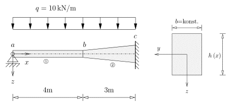
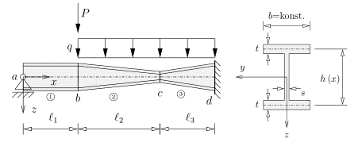

**************************************************
Übertragungsbeziehungen der Stabtheorie I. Ordnung
**************************************************
.. Important:: 
    (todo: Referenzen!!!)

Grundlagen
==========
Ausgangspunkt der Herleitung der Übertragungsbeziehungen für Stäben mit linear veränderlicher Höhe sind die die Differentialgleichungen :eq:`differential_equations` des Biegeproblems 
der Stabtheorie I. Ordnung

.. math::
    :label: differential_equations

    \frac{dV(x)}{dx} &= -q(x) \\[1em] 
    \frac{dM(x)}{dx} &= V(x) + m(x)\\[1em]            
    \frac{d\varphi(x)}{dx} &= -\left[\frac{M(x)}{EI(x)}+\kappa(x)\right]\\[1em] 
    \frac{dw(x)}{dx} &= \varphi (x) 

.. Important:: 
    Die Differnetialgleichungen sind spezialisiert für den Fall der Schubstarrheit :math:`G\tilde{A}(x)=\infty`

Integrationsschritte
--------------------
Die gesuchten, von x abhängigen, Zustandsgrößen ergeben sich durch Schritt für Schritt aufintegrieren der Differnetialgleichungen :eq:`differential_equations`.
Nach jedem Integrationsschritt werden die Integrationskonstanten auf die andere Seite gebracht sowie die lastabhängigen Terme zu sogenannte 
Lastgliedern zusammengefasst. (todo: ref Funktion load_integrals). Zusätzlich wird zur Vereinfachung der Integrale die dimensionslose Funktion :math:`f(x)` eingeführt. 
Dabei können die von x Abhängigen Querschnittswerte einfach über die Funktion cs (todo: Link zu Querschnittswerten) bestimmt werden.

.. math::
    :label: iteration_steps

    f(x)&=\frac{I(x)}{I(0)}=\frac{I(x)}{I_i}\\[1em]
    V(x) &= V_i - \underbrace{\int_0^x q(x)~dx}_{V^L(x)} = V_i + V^L(x)\\[1em]
    M(x) &= M_i + V_i~x + \underbrace{\int_0^x V^L(x) + m(x)~dx}_{M^L(x)} =  M_i + V_i~x + M^L(x)\\[1em]
    \varphi(x) &= \varphi_i - \frac{M_i}{EI_i}\underbrace{\int_0^x\frac{1}{f(x)}~dx}_{b'_2(x)} - \frac{V_i}{EI_i}\underbrace{\int_0^x\frac{x}{f(x)}~dx}_{b'_3(x)} - \underbrace{\int_0^x\left[\frac{M^L(x)}{EI_i~f(x)}~dx+\kappa(x)\right]~dx}_{\varphi^L(x)}\\[1em]
    w(x) &= w_i + \varphi_i~x - \frac{M_i}{EI_i}\underbrace{\iint_0^x\frac{1}{f(x)}~dx^2}_{b_2(x)}- \frac{V_i}{EI_i}\underbrace{\iint_0^x\frac{x}{f(x)}~dx^2}_{b_3(x)} + \underbrace{\int_0^x\varphi^L(x)~dx}_{w^L(x)}

Alle  :math:`b(x)` - Funktionen (transfer_relation_bj - future_todo: link) sowie die Lastintegrale :math:`V^L(x),~M^L(x),~\varphi^L(x),~w^L(x)` 
(load_integrals - future_todo: link) werden in stanpy (todo: eigenen Schriftzug) mittels numerischer Integration über 
das scipy.integrate.quad (todo: link zu scipy) gelöst.

Lastintegrale für die Querkraftbelastung: (todo: Abbildungen, check sign)

.. math::
    :label: load_integrals_V

    V^{L,V}(x) &= - \int_0^x \langle x-x_j\rangle^0F~dx-\int_0^x q(x)~dx\\[1em]
    M^{L,V}(x) &= - \iint_0^x \langle x-x_j\rangle^0F~dx^2-\iint_0^x q(x)~dx^2\\[1em]
    \varphi^{L,V}(x) &= \frac{F}{EI_i}\int_0^x \frac{\iint_0^x \langle x-x_j\rangle^0~dx^2}{f(x)}~dx+
    \frac{1}{EI_i}\int_0^x \frac{\iint_0^x q(x)~dx^2}{f(x)}~dx\\[1em]
    w^{L,V}(x) &= \frac{F}{EI_i}\iint_0^x \frac{\iint_0^x  \langle x-x_j\rangle^0~dx^2}{f(x)}~dx^2+
    \frac{1}{EI_i}\iint_0^x \frac{\iint_0^x q(x)~dx^2}{f(x)}~dx^2

Lastintegrale für die Momentenbelastung (todo: check sign): 

.. Note:: 
    (todo: minimal working example)

.. Hint:: 
    (todo: Maculay Operator beschreiben + Integrationsregel)

.. math::
    :label: load_integrals_M

    V^{L,M}(x) &= 0\\[1em]
    M^{L,M}(x) &= M^e \int_0^x \langle x-x_j\rangle^0~dx+\int_0^x m(x)~dx\\[1em]
    \varphi^{L,M}(x) &= -\frac{M^e}{EI_i}\int_0^x \frac{\int_0^x \langle x-x_j\rangle^0~dx^2}{f(x)}~dx-
    \frac{1}{EI_i}\int_0^x\frac{\int_0^x m(x)~dx}{f(x)}~dx\\[1em]
    w^{L,M}(x) &= -\frac{M^e}{EI_i}\iint_0^x \frac{\int_0^x \langle x-x_j\rangle^0~dx}{f(x)}~dx^2-
    \frac{1}{EI_i}\iint_0^x\frac{\int_0^x m(x)~dx}{f(x)}~dx^2

.. Note:: 
    (todo: minimal working example)

.. Hint:: 
    (todo: Maculay Operator beschreiben + Integrationsregel)

Aufgrund der Linearität der Differentialgleichungen können die Lastglieder der verschiedenen Belastungtypen superpositioniert werden. Daher folgt:

.. math::
    :label: load_integrals_superposition

    V^{L}(x) &=  V^{L,V}(x)+V^{L,M}(x) \\[1em]
    M^{L}(x) &=  M^{L,V}(x)+M^{L,M}(x) \\[1em]
    \varphi^{L}(x) &= \varphi^{L,V}(x)+\varphi^{L,M}(x) \\[1em]
    w^{L}(x) &=  w^{L,V}(x)+w^{L,M}(x)

Zusammenfassen zu den Übertragungsbeziehungen
---------------------------------------------
Durch das Anschreiben der Gleichungen aus :eq:`iteration_steps` und :eq:`load_integrals_V` in Matrix Vektor Form, ergeben sich die Übertragungsbeziehungen für einen Stab mit linear veränderlicher Höhe
vom Stabanfang bis zu einem beliebigen Punkt x zu:

.. math::
    :label: transferrelations_height_eq

    \underbrace{\left[\begin{array}{c}
                        w(x)\\
                       \varphi(x) \\
                        M(x)\\
                        V(x)\\
                        1
                        \end{array}
                        \right]}_{\vec{Z_x}}
                        =
                        \underbrace{\left[\begin{array}{ccccc}
                        1&x&-b_2/EI_i&-b_3/EI_i&w^L(x)\\
                        0&1&-b'_2/EI_i&-b'_3/EI_i&\varphi^L(x)\\
                        0&0&1&x&M^L(x)\\
                        0&0&0&1&V^L(x)\\
                        0&0&0&0&1\\
                        \end{array}
                        \right]}_{\boldsymbol{F_{xi}}}\cdot\underbrace{\left[\begin{array}{c}
                        w_i\\
                       \varphi_i\\
                        M_i\\
                        V_i\\
                        1
                        \end{array}
                        \right]}_{\vec{Z_i} }

(DEV) Pre-implementation
========================
.. Note:: 

    .. Warning:: 

    (DEV) - Development Sections dienen nur der Entwicklung und werden vor Release gelöscht
   
    (todo: Löschen vor Release)

        - Definition der Problemstellung/Kenngrößen
        - für jeden Stab
          - Defintion der Randbedingungen (wenn vorhanden)
          - Berechnen der Querschnittswerte
          - Definition des Stab-Dictionarys
          - Berechnen der Übertragungsbeziehungen
        - Zusammenführen der Übertragungsbeziehungen
        - Lösen durch Randbedingungen
        - Rückrechnen der Zustandsvektoren am Stabanfang und Stabende (für jeden Stab)
        - Einhängen der Belastungsfunktionen (TH I)
        - Numerisches Lösen über Stabpunkte über (einhängen von Curve-Fit) (TH II)

(DEV) Userbility-Studie 
=======================
.. Warning:: 

    (DEV) - Development Sections dienen nur der Entwicklung und werden vor Release gelöscht

::

    import stanpy as stp 
    from sympy.abc import x

    # Definition der Problemstellung ################

    EI = ... # kN/m²
    q = ... # kN/m
    l = ... # m
    P = ... # kN
    b, h = ..., ... # m 

Variation GEOM 0 
----------------
.. Note::

    (!) Geometrie: 
        * jedem Stab ist eine Länge zugeordnet
    Materialeigenschaften: 
        * kann direkt zugeordnet werden (analog zu allen Varianten)
    Belastung: (analog zu allen Varianten)
        * q - kann direkt zugeordnet werden 
        * F - über Tupel (dim=2) bestehnd aus Kraft und Abstand x_j zum Knotenanfang 
        * geplant: zus. Rotation für die Kraft F (dim=3)
    Randbedingunen/Übergangsbedingungen: 
        * werden über Stabanfangsbedingung "bc_i" und Stabendbedingung "bc_k" zugeordnet
    Nachlauf/Solve: 
        * Stäbe werden in Stabliste zusammengefasst und übergeben bzw. gesolved
  

.. code-block:: python
   :linenos:
   :emphasize-lines: 5,10

    roller_support = {"w":0, "M":0} # Gleitlager
    hinge = {"M":0}
    fixed_support = {"w":0, "phi":0} # Einspannung

    s1 = {"l":l, # (!)
          "EI":EI, 
          "q":q, "F":(P,l/2), 
          "bc_i":roller_support, "bc_k":hinge} 

    s2 = {"l":l, # (!)
          "EI":EI, 
          "q":q, "F":(P,l/2), 
          "bc_i":{}, "bc_k":fixed_support}

    s_list = [s1,s2]

    s_list = stp.tr_solve(s_list)

Variation GEOM 1 =  BC 0 
------------------------
.. Note::

    (!) Geometrie: 
        * jedem Stab ist ein Anfangsknoten k_i und ein Endknoten k_k zugeordnet
    Materialeigenschaften: 
        * kann direkt zugeordnet werden (analog zu allen Varianten)
    Belastung: (analog zu allen Varianten)
        * q - kann direkt zugeordnet werden 
        * F - über Tupel (dim=2) bestehnd aus Kraft und Abstand x_j zum Knotenanfang 
        * geplant: zus. Rotation für die Kraft F (dim=3)
    (!) Randbedingunen/Übergangsbedingungen: 
        * werden über Stabanfangsbedingung "bc_i" und Stabendbedingung "bc_k" zugeordnet
    Nachlauf/Solve: 
        * Stäbe werden in Stabliste zusammengefasst und übergeben bzw. gesolved

.. code-block:: python
   :linenos:
   :emphasize-lines: 9,14

    node_1 = (x1,y1)
    node_2 = (x2,y2)
    node_3 = (x3,y3)

    roller_support = {"w":0, "M":0} # Gleitlager
    hinge = {"M":0}
    fixed_support = {"w":0, "phi":0} # Einspannung

    s1 = {"k_i":node_1, "k_k": node_2, # (!) 
          "EI":EI, 
          "q":q, "F":(P,l/2), 
          "bc_i":roller_support, "bc_k":hinge} # (!)

    s2 = {"k_i":node_2, "k_k": node_3, # (!) 
          "EI":EI, 
          "q":q, "F":(P,l/2), 
          "bc_i":{}, "bc_k":fixed_support} # (!)

    s_list = [s1,s2] # oder s_list = [s2,s1] 

    s_list = stp.tr_solve(s_list)

Variation BC 1 
--------------
.. Note::
    
    Geometrie: 
        * jedem Stab ist ein Anfangsknoten k_i und ein Endknoten k_k zugeordnet
    Materialeigenschaften: 
        * kann direkt zugeordnet werden (analog zu allen Varianten)
    Belastung: (analog zu allen Varianten)
        * q - kann direkt zugeordnet werden 
        * F - über Tupel (dim=2) bestehnd aus Kraft und Abstand x_j zum Knotenanfang 
        * geplant: zus. Rotation für die Kraft F (dim=3)
    (!) Randbedingunen: 
        * werden über Stabanfangsbedingung "bc_i" und Stabendbedingung "bc_k" zugeordnet
    (!) Übergangsbedingung:
        * durch hinzufügen eines Gelenks in Stabliste
    Nachlauf/Solve: 
        * Stäbe werden in Stabliste zusammengefasst und übergeben bzw. gesolved

.. code-block:: python
   :linenos:
   :emphasize-lines: 8,13

    roller_support = {"w":0, "M":0} # Gleitlager
    hinge = {"M":0}
    fixed_support = {"w":0, "phi":0} # Einspannung

    s1 = {"k_i":(x1,y1), "k_k": (x2,y2), 
          "EI":EI, 
          "q":q, "F":(P,l/2), 
          "bc_i":roller_support} # (!)

    s2 = {"k_i":(x1,y1), "k_k": (x2,y2),
          "EI":EI, 
          "q":q, "F":(P,l/2),
          "bc_k":fixed_support} # (!)

    s_list = [s1,hinge,s2] # (!)

Variation BC 2 
--------------
.. Note::

    Geometrie: 
        * jedem Stab ist ein Anfangsknoten k_i und ein Endknoten k_k zugeordnet
    Materialeigenschaften: 
        * kann direkt zugeordnet werden (analog zu allen Varianten)
    Belastung: (analog zu allen Varianten)
        * q - kann direkt zugeordnet werden 
        * F - über Tupel (dim=2) bestehnd aus Kraft und Abstand x_j zum Knotenanfang 
        * geplant: zus. Rotation für die Kraft F (dim=3)
    (!) Randbedingunen/Übergangsbedingung: 
        * Reihenfolge in Stabliste definiert die Rand und Übergangsbedingungen
    Nachlauf/Solve: 
        * Stäbe werden in Stabliste zusammengefasst und übergeben bzw. gesolved

.. code-block:: python
   :linenos:
   :emphasize-lines: 15

    roller_support = {"w":0, "M":0} # Gleitlager
    hinge = {"M":0}
    fixed_support = {"w":0, "phi":0} # Einspannung

    s1 = {"k_i":(x1,y1), "k_k": (x2,y2), 
          "EI":EI, 
          "q":q, "F":(P,l/2), 
          } 

    s2 = {"k_i":(x1,y1), "k_k": (x2,y2), 
          "EI":EI,
          "q":q, "F":(P,l/2), 
          } 

    s_list = [roller_support, s1, hinge, s2, fixed_support] # (!) 

::

    # Lösen des Gleichungssystems ###################

    s = stp.tr_solve(s_list)

Eingliedrig (R-Querschnitt, konstante Höhe) 
===========================================
stanpy black-box (Level 0)
--------------------------
(todo: Abbildungen)

.. code-block:: python
   :linenos:

    import stanpy as stp 
    from sympy.abc import x

    # Definition der Problemstellung ################

    E = 3*10**7 # kN/m²
    q = 10 # kN/m
    l = 2 # m
    P = 3 # kN
    b, h = 0.2, 0.3 # m 

    # Stab 1 ########################################

    cs1_prop = stp.cs(b=b, h=h) # oder EI = E*b*h**3/12
    bc_a = {"w":0, "M":0} # Gleitlager in a
    bc_b = {"w":0, "phi":0} # Einspannung in b
    s = {"l":l, "q":q, "F":(P,l/2),"EI":E*cs1_prop["I"], "bc_i":bc_a, "bc_k":bc_b} 

    # Lösen des Gleichungssystems ###################

    s = stp.tr_solve(s)

    # Plotten der Ergebnisse #########################

    fig, (ax_M, ax_V) = plt.subplots(2)

    stp.plot(s, ax=ax_M)
    stp.plot_M(s, ax=ax_M)

    stp.plot(s, ax=ax_V)
    stp.plot_V(s, ax=ax_V)

    plt.show() # (todo: show py-Plot)

stanpy step-by-step (Level 1)
-----------------------------
(todo: Abbildungen)

.. code-block:: python
   :linenos:

    import stanpy as stp 
    from sympy.abc import x

    # Definition der Problemstellung ################

    E = 3*10**7 # kN/m²
    q = 10 # kN/m
    l = 2 # m
    P = 3 # kN
    b, h = 0.2, 0.3 # m 

    # Stab 1 ########################################

    (todo)

without stanpy  (Level -1)
--------------------------
(todo: Abbildungen)

.. code-block:: python
   :linenos:

    import stanpy as stp 
    from sympy.abc import x

    # Definition der Problemstellung ################

    E = 3*10**7 # kN/m²
    q = 10 # kN/m
    l = 2 # m
    P = 3 # kN
    b, h = 0.2, 0.3 # m 

    # Stab 1 ########################################

    (todo)

Eingliedrig (R-Querschnitt, veränderliche Höhe) 
===============================================
stanpy black-box (Level 0)
--------------------------
(todo: Abbildungen)

.. code-block:: python
   :linenos:

    import stanpy as stp 
    from sympy.abc import x

    # Definition der Problemstellung ################

    E = 3*10**7 # kN/m²
    q = 10 # kN/m
    l = 2 # m
    P = 3 # kN
    b, ha, hb = 0.2, 0.3, 0.2 # m 

    # Stab 1 ########################################

    hx = ha+(hb-ha)/l*x # m 
    cs1_prop = stp.cs(b=b, h=hx)
    bc_a = {"w":0, "M":0} # Gleitlager in a
    bc_b = {"w":0, "phi":0} # Einspannung in b
    s = {"l":l, "q":q, "F":(P,l/2),"EI":E*cs1_prop["I"], "bc_i":bc_a, "bc_k":bc_b} 

    # Lösen des Gleichungssystems ###################

    s = stp.tr_solve(s)

    # Plotten der Ergebnisse#########################

    fig, (ax_M, ax_V) = plt.subplots(2)

    stp.plot(s, ax=ax_M)
    stp.plot_M(s, ax=ax_M)

    stp.plot(s, ax=ax_V)
    stp.plot_V(s, ax=ax_V)

    plt.show() # (todo: show py-Plot)

stanpy step-by-step (Level 1)
-----------------------------
(todo: Abbildungen)

.. code-block:: python
   :linenos:

    import stanpy as stp 
    from sympy.abc import x

    # Definition der Problemstellung ################

    E = 3*10**7 # kN/m²
    q = 10 # kN/m
    l = 2 # m
    P = 3 # kN
    b, ha, hb = 0.2, 0.3, 0.2 # m 

    # Stab 1 ########################################

    (todo)

without stanpy  (Level -1)
--------------------------
(todo: Abbildungen)

.. code-block:: python
   :linenos:

    import stanpy as stp 
    from sympy.abc import x

    # Definition der Problemstellung ################

    E = 3*10**7 # kN/m²
    q = 10 # kN/m
    l = 2 # m
    P = 3 # kN
    b, ha, hb = 0.2, 0.3, 0.2 # m 

    # Stab 1 ########################################

    (todo)

Eingliedrig (I-Querschnitt, konstante Höhre)
============================================
stanpy black-box (Level 0)
--------------------------

.. code-block:: python
   :linenos:

    import stanpy as stp 
    from sympy.abc import x

    # Definition der Problemstellung ################

    E = 3*10**7 # kN/m²
    q = 10 # kN/m
    l = 2 # m
    P = 3 # kN
    t = 0.2 
    s = 0.08
    b, ha, hb = 0.2, 0.3, 0.2 # m   

    # Stab 1 ########################################
    hx = ha+(hb-ha)/l*x # m 

    b_vec = np.array([b,s,b]) # Breiten der QS 
    h_vec = np.array([t, hx-2*t, t]) # Höhen der QS 

    cs1_prop = stp.cs(b=b_vec, h=h_vec)
    bc_a = {"w":0, "M":0} # Gleitlager in a
    bc_b = {"w":0, "phi":0} # Einspannung in b
    slab = {"l":l, "q":q, "P":(P, l/2), "EI":E*cs1_prop["I"], "bc_i":bc_a, "bc_k":bc_b} 

    # Lösen des Gleichungssystems ###################

    slab = stp.tr_solve(slab)

    # Plotten der Ergebnisse#########################

    fig, (ax_M, ax_V) = plt.subplots(2)

    stp.plot(slab, ax=ax_M)
    stp.plot_M(slab, ax=ax_M)

    stp.plot(slab, ax=ax_V)
    stp.plot_V(slab, ax=ax_V)

    plt.show() # (todo: show py-Plot)

stanpy step-by-step (Level 1)
-----------------------------
(todo: Abbildungen)

.. code-block:: python
   :linenos:

    import stanpy as stp 
    from sympy.abc import x

    # Definition der Problemstellung ################

    E = 3*10**7 # kN/m²
    q = 10 # kN/m
    l = 2 # m
    P = 3 # kN
    t = 0.2 
    s = 0.08
    b, ha, hb = 0.2, 0.3, 0.2 # m 

    # Stab 1 ########################################

    (todo)

Eingliedrig (I-Querschnitt, veränderliche Höhe)
===============================================
(todo)
Zweigliedrig - (R-Querschnitt)
==============================

stanpy black-box (Level 0)
--------------------------

.. code-block:: python
   :linenos:

    import stanpy as stp 
    from sympy.abc import x

    # Definition der Problemstellung ################

    E = 3*10**7 # kN/m²
    q = 10 # kN/m
    l = 2 # m
    b, ha, hb, hc = 0.2, 0.3, 0.3, 0.4 # m 

    # Stab 1 ########################################

    cs1_prop = stp.cs(b=b, h=ha)
    bc_a = {"w":0, "M":0} # Gleitlager in a
    s_1 = {"l":l, "q":q, "E":E, "I":cs1_prop["I"], "bc_i":bc_a} 

    # Stab 2 ########################################

    hx = hb+(hb-hc)/l*x # m 
    cs2_prop = stp.cs(b=b, h=hx)
    bc_c = {"w":0, "phi":0} # Einspannung in c
    s_2 = {"l":l, "q":q, "E":E, "I":cs2_prop["I"], "bc_k":bc_c}

    # Lösen des Gleichungssystems + Injektion #######

    s_1, s_2 = stp.tr_solve(s_1, s_2)

    # Plotten #######################################

    fig, ax = plt.subplots()
    stp.plot(s1,s2, ax=ax, m=True)
    plt.show() # (todo: show py-Plot)

.. Hint::
    Ein leeres Dictionary bc = {} für die Randbedingung bedeutet, dass alle Zustandsgrößen unbekannt sind

stanpy step-by-step (Level 1)
-----------------------------

.. code-block:: python
   :linenos:

    import stanpy as stp 
    from sympy.abc import x
    import matplotlib.pyplot as plt

    # Definition der Problemstellung ################

    E = 3*10**7 # kN/m²
    q = 10 # kN/m
    l = 2 # m
    b, ha, hb, hc = 0.2, 0.3, 0.3, 0.4 # m 
    
    # Stab 1 ########################################

    cs1_prop = stp.cs(b=b, h=ha)
    s1 = {'l':l, 'q':q, 'EI':E*cs1_prop["I"]} 
    li = stp.tr1_load_integrals(s1)
    bj = stp.tr1_bj_function(s1)
    fba = stp.tr(s1)

    # Stab 2 ########################################

    hx = ha+(hb-ha)/l*x # m 
    cs2_prop = stp.cs(b=b, h=hx)
    s_2 = {"l":l, "q":q, "EI":E*cs2_props["I"]} 

    li = stp.tr1_load_integrals(s1)
    bj = stp.tr1_bj_function(s1)
    fcb = stp.tr(s2)

    # Stabzug 1-2 ###################################

    f_ca = f_cb * f_ba 

    # Lösen des Gleichungssystems ###################

    z_a = {"w":0, "M":0} 
    z_c = {"w":0, "phi":0}
    z_c, z_a = stp.solve_tr(z_c, f_ca, z_a)
    z_b = f_ba*z_a

    (todo: besseren Namen für inject_function finden)
    s_1 = stp.inject_function(s_1, z_a, z_b) # Einhängen der Zustandsfunktionen
    s_2 = stp.inject_function(s_2, z_b, z_c) # Einhängen der Zustandsfunktionen

    # Plotten #######################################

    fig, ax = plt.subplots()
    stp.plot(s1,s2, ax=ax, m=True)
    plt.show()

.. Handstatik (Level 0)
.. --------------------
.. (Q: Implementation ohne Stanpy?)

.. ::

..     import stanpy as stp 
..     from sympy.abc import x

..     E = 3*10**7 # kN/m²
..     q = 10 # kN/m
..     l = 2 # m

..     b, ha, hb, hc = 0.2, 0.3, 0.3, 0.4 # m 
..     hx = ha+(hb-ha)/l*x # m 

..     # Stab 1 ########################################
..     cs1_prop = stp.cs(b=b, h=ha)
..     s1 = {'l':l, 'q':q, 'EI':E*cs1_prop["I"]} 
..     li = stp.tr1_load_integrals(s1)
..     bj = stp.tr1_bj_function(s1)
..     fba = np.array(
..         [1,s1['l'],-bj[0,0]/s1['EI'],-bj[0,0]/s1['EI'], li[0]],
..         [0,1,-bj[1,0]/s1['EI'],-bj[1,0]/s1['EI'], li[1]],
..         [0,0,1,s1['l'], li[2]],
..         [0,0,0,1,li[3]],
..         [0,0,0,0,li[4]],
..         )

..     # Stab 2 ########################################
..     cs2_prop = stp.cs(b=b, h=hx)
..     s_2 = {"l":l, "q":q, "EI":E*cs2_props["I"]} 

..     li = stp.tr1_load_integrals(s1)
..     bj = stp.tr1_bj_function(s1)
..     fcb = np.array(
..         [1,s2['l'],-bj[0,0]/s2['EI'],-bj[0,0]/s2['EI'], li[0]],
..         [0,1,-bj[1,0]/s2['EI'],-bj[1,0]/s2['EI'], li[1]],
..         [0,0,1,s2['l'], li[2]],
..         [0,0,0,1,li[3]],
..         [0,0,0,0,li[4]]
..         )
 
..     f_ca = f_cb * f_ba 

..     z_a = {"w":0, "M":0}
..     z_c = {"w":0, "phi":0}

..     z_c, z_a = stp.solve_tr(z_c, f_ca, z_a)
..     z_b = f_ba*z_a

..     s_1 = stp.inject_bc(s_1, z_a, z_b)
..     s_2 = stp.inject_bc(s_2, z_b, z_c)

Dreigliedrig (I-Querschnitt)
============================

stanpy black-box (Level 0)
--------------------------
::

    import stanpy as stp 
    from sympy.abc import x

    # Definition der Problemstellung ################

    (todo: richtigen Werte einsetzen)
    E = 3*10**7 # kN/m²
    q = 10 # kN/m
    l1, l2, l3 = 1, 2, 1 # m
    t = 0.2 
    s = 0.08
    b, ha, hb, hc, hd = 0.2, 0.3, 0.3, 0.2, 0.3 # m 
    
    b_vec = np.array([b,s,b]) # Breiten der QS 

    # Stab 1 ########################################

    h_vec = np.array([t, ha-2*t, t]) # Höhen der QS 
    cs1_prop = stp.cs(b=b_vec, h=h_vec)
    bc_a = {"w":0, "M":0} # Gleitlager in a
    bc_b = {"dV":P} # Einzelkraft in b (positiv in z-Richtung)

    s_1 = {"l":l1, "EI":E*cs1_prop["I"], "bc_i":bc_a, "bc_k":bc_b} 

    # Stab 2 ########################################

    hx = hb-(hb-hc)/l2*x # m 
    h_vec = np.array([t, hx-2*t, t]) # Höhen der QS
    cs2_prop = stp.cs(b=b_vec, h=h_vec)
    s_2 = {"l":l2, "q":q, "EI":E*cs2_prop["I"]}

    # Stab 3 ########################################

    hx = hb-(hb-hc)/l3*x # m 
    h_vec = np.array([t, hx-2*t, t]) # Höhen der QS
    cs2_prop = stp.cs(b=b_vec, h=h_vec)
    s_2 = {"l":l2, "q":q, "EI":E*cs2_prop["I"]}

    # Lösen des Gleichungssystems + Injektion #######

    s_1, s_2, s_3 = stp.tr_solve(s_1, s_2, s_3)

    # Plotten #######################################

    fig, ax = plt.subplots()
    stp.plot(s_1,s_2, ax=ax, m=True)
    plt.show() # (todo: show py-Plot)

.. Hint::
    Ein leeres Dictionary bc = {} für die Randbedingung bedeutet, dass alle Zustandsgrößen unbekannt sind

.. Handstatik (Level 0)
.. --------------------
.. (Q: Implementation ohne Stanpy?)

.. ::

..     import stanpy as stp 
..     from sympy.abc import x

..     E = 3*10**7 # kN/m²
..     q = 10 # kN/m
..     l = 2 # m

..     b, ha, hb, hc = 0.2, 0.3, 0.3, 0.4 # m 
..     hx = ha+(hb-ha)/l*x # m 

..     # Stab 1 ########################################
..     cs1_prop = stp.cs(b=b, h=ha)
..     s1 = {'l':l, 'q':q, 'EI':E*cs1_prop["I"]} 
..     li = stp.tr1_load_integrals(s1)
..     bj = stp.tr1_bj_function(s1)
..     fba = np.array(
..         [1,s1['l'],-bj[0,0]/s1['EI'],-bj[0,0]/s1['EI'], li[0]],
..         [0,1,-bj[1,0]/s1['EI'],-bj[1,0]/s1['EI'], li[1]],
..         [0,0,1,s1['l'], li[2]],
..         [0,0,0,1,li[3]],
..         [0,0,0,0,li[4]],
..         )

..     # Stab 2 ########################################
..     cs2_prop = stp.cs(b=b, h=hx)
..     s_2 = {"l":l, "q":q, "EI":E*cs2_props["I"]} 

..     li = stp.tr1_load_integrals(s1)
..     bj = stp.tr1_bj_function(s1)
..     fcb = np.array(
..         [1,s2['l'],-bj[0,0]/s2['EI'],-bj[0,0]/s2['EI'], li[0]],
..         [0,1,-bj[1,0]/s2['EI'],-bj[1,0]/s2['EI'], li[1]],
..         [0,0,1,s2['l'], li[2]],
..         [0,0,0,1,li[3]],
..         [0,0,0,0,li[4]]
..         )
 
..     f_ca = f_cb * f_ba 

..     z_a = {"w":0, "M":0}
..     z_c = {"w":0, "phi":0}

..     z_c, z_a = stp.solve_tr(z_c, f_ca, z_a)
..     z_b = f_ba*z_a

..     s_1 = stp.inject_bc(s_1, z_a, z_b)
..     s_2 = stp.inject_bc(s_2, z_b, z_c)

.. meta::
    :description lang=de:
        Examples of document structure features in pydata-sphinx-theme.
